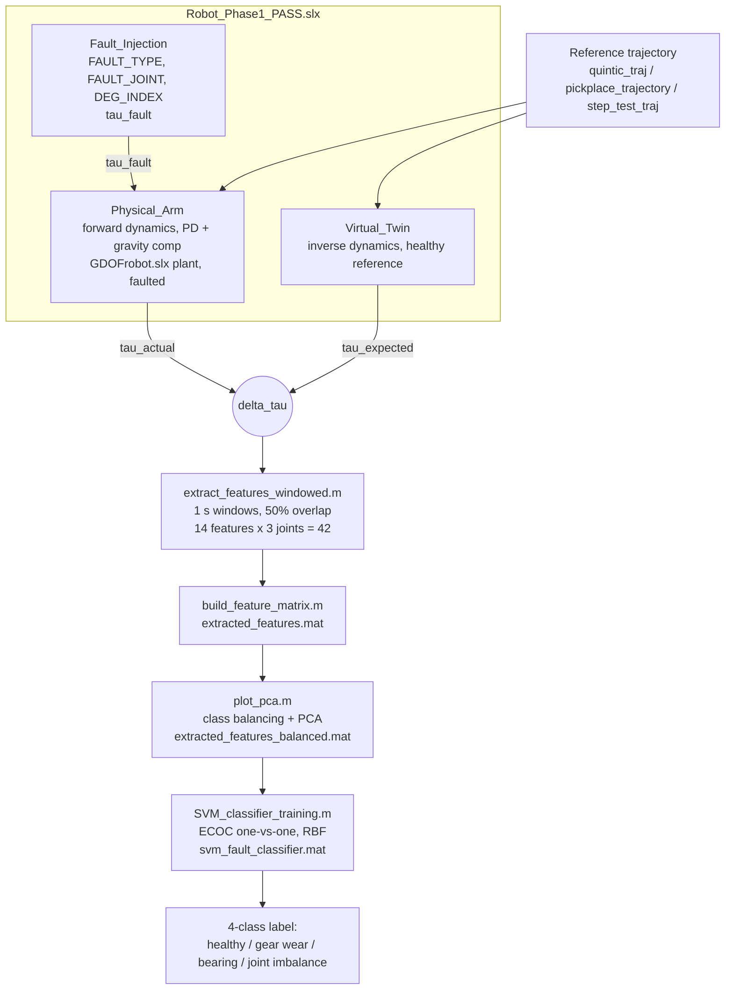

# Digital Twin Predictive Maintenance

A Simscape Multibody digital twin of a 3-DOF robot arm, used as a fault factory: it generates
labelled healthy and faulty runs that would be expensive and unsafe to seed on real hardware, and a
classifier is trained on the residual torque between the physical arm and a healthy virtual twin.

The diagnostic signal is one subtraction. A `Physical_Arm` runs forward dynamics with a fault
injected into a joint; a `Virtual_Twin` runs inverse dynamics on the same reference trajectory with
no fault. What is left over,

```
delta_tau = tau_actual - tau_expected
```

is torque the healthy model cannot account for. Everything downstream is feature extraction and
classification on that residual.

## What is in this repository, and what is not

This repository is the **simulation half plus the first classifier prototype**. It contains the
Simscape model, the trajectory generators, the PD gain fitting, the forward-kinematics cross-check,
the dataset generator, the 42-feature extractor, and a flat multiclass SVM.

It does **not** contain the four-stage hierarchical classifier, the 1,800-run dataset, the MATLAB
dashboard or the report. Those are part of the same case study and their results are quoted below
as reported, clearly marked, rather than presented as reproducible from this checkout. Bulk `.mat`
runs are excluded by `.gitignore` with one sample kept per category, so the classifier scripts here
will not reproduce a published number without regenerating the dataset first.

Reading this repository, the honest summary is: the flat SVM stage is the one that did not work
well enough, and it is kept because the reason it did not is the interesting part. See
[Why the flat prototype scored 59.6%](#why-the-flat-prototype-scored-596) below.

## The machine

A 3-DOF revolute arm imported from a SolidWorks assembly through Simscape Multibody
(`GDOFrobot_DataFile.m` carries the exported geometry, so the inertias are CAD-derived rather than
invented):

| joint | name | body | mass |
|---|---|---|---|
| fixed | base | `base` | 3.888 kg |
| J1 | waist | `base_joint` | 1.638 kg |
| J2 | shoulder | `Link1` | 3.256 kg |
| J3 | elbow | `Link2` | 2.275 kg |

Control is PD plus gravity compensation, with the gains fitted rather than guessed
(`estimate_pd_gains.m`). The kinematics are cross-checked against an independent forward-kinematics
implementation to under 1 mm (`fk_crosscheck.m`) before any fault work is done, because a diagnosis
built on a model that does not agree with itself is not a diagnosis.

Payload is a simulation variable (`sim_payload_mass`), swept at 0.5, 1.5 and 2.5 kg so that load is
a nuisance variable the classifier has to survive rather than a hidden label.

## Architecture



## Fault injection

Three fault families, each injectable at any one of the three joints, set from the base workspace by
`set_fault(fault_type, joint_id, degradation_index)`:

| `FAULT_TYPE` | family | parameter vector |
|---|---|---|
| 0 | healthy | none |
| 1 | gear wear | `GEAR_PARAMS = [6.0 7.5 3.0 0.75 28.0]` |
| 2 | bearing | `BEAR_PARAMS = [4.0 3.0 1.5 35.0 42.0 55.0 6.0]` |
| 3 | joint imbalance | `IMB_PARAMS = [5.0 7.5 2.5 1.5]` |

`DEG_INDEX` is a continuous severity in [0, 1] that scales the injected effect, so severity is a
regression variable in the data even where it is later bucketed into three levels. The parameter
vectors carry the per-family shape (characteristic frequencies for the bearing case, tooth-meshing
terms for gear wear, an unbalance amplitude for imbalance); the model subsystem consumes them.

## Data generation

`generate_dataset_v2.m` runs the sweep:

* four conditions: healthy, gear wear, bearing, joint imbalance
* three joints per fault (healthy has no joint, so `joint_id = 0`)
* twenty severities, `linspace(0.5, 1.0, 20)`
* payload cycling through 0.5, 1.5, 2.5 kg
* 20 s per run at 1 kHz

which is 20 healthy runs plus 3 faults x 3 joints x 20 severities, so 200 runs for this version.
Each run is saved as one `.mat` holding the full logged signals: `tau_actual`, `tau_expected`,
`delta_tau`, `q_actual`, `dq_actual`, `current_actual`, the reference `q_ref / dq_ref / ddq_ref`,
and the tracking error in degrees, alongside its own labels and quality fields. The schema is
written out in [`data/healthy/README_healthy_50.txt`](data/healthy/README_healthy_50.txt).

Runs are quality-gated rather than trusted. A run is only usable if the residual and the tracking
error stay inside limits set per joint, `[2.0 3.0 2.0]` Nm and `[3.0 8.0 8.0]` degrees, with the
first 0.5 s of startup excluded from the metrics.

## Features

`extract_features_windowed.m` drops the first and last two seconds of each run as transient, then
cuts 1 s windows at 50% overlap. Fourteen features per joint, three joints, 42 in total:

**Time domain (8):** RMS, mean absolute value, standard deviation, kurtosis, crest factor,
skewness, shape factor (RMS over mean absolute), impulse factor (peak over mean absolute).

**Frequency domain (6):** band power ratios over 0 to 10 Hz, 10 to 50 Hz and 50 to 200 Hz, spectral
centroid, spectral peak frequency, spectral entropy.

The split is deliberate. Kurtosis, crest and impulse factor are the classical impulsive-fault
indicators that a bearing defect should move; the band ratios and the peak frequency are where
periodic gear and imbalance signatures live.

`plot_pca.m` balances the classes by undersampling to the smallest one, prints the variance
explained by the first two principal components, and writes the balanced matrix that training
consumes.

## Classifier and evaluation, as implemented here

`SVM_classifier_training.m`: z-score normalisation, a stratified 80/20 hold-out split, then a
multiclass error-correcting-output-code model (`fitcecoc`) over one-vs-one RBF SVMs with
`BoxConstraint = 1` and automatic kernel scale. It prints overall and per-class test accuracy and
draws a row and column normalised confusion chart.

Two things about this that are worth stating plainly, because they bound what the number means:

* **The split is by window, not by run.** Windows overlap by 50% and many windows come from the
  same simulation, so neighbouring windows are not independent and a plain hold-out leaks. The
  grouped, leave-one-trajectory-out validation that fixes this is part of the later pipeline, not
  this script.
* **It is a single hold-out**, so there is no interval on the accuracy it prints.

### Why the flat prototype scored 59.6%

The case study records this flat 42-feature SVM at roughly 59.6% four-class accuracy, and the
diagnosis of that number is the useful part of this repository. Three things were wrong:

1. **A synthetic encoder-noise artifact.** `generate_dataset_v2.m` injects
   `enc_noise_signal = randn(length(t_noise), 3)` as unit-variance white noise. That is far louder
   and far flatter than any real encoder, and it sits directly on top of the spectral features the
   fault families are supposed to be separated by.
2. **One flat four-way decision.** Asking a single model to answer "is it faulty, which fault,
   which joint and how bad" at once forces one decision boundary to carry four unrelated questions.
3. **Too narrow a feature set** for the joint-localisation and severity questions in particular.

The published pipeline fixed all three: the noise artifact was removed, the feature set widened,
and the flat model replaced by a four-stage hierarchy.

## Reported results of the full study

**These are not reproducible from this checkout.** They come from the case study report, whose
classifier stage is not in this repository, and they are quoted here so this repo is not read as
the whole project.

| stage | reported |
|---|---|
| full diagnosis, all four stages correct | 94.4 ± 1.6% |
| binary healthy vs faulty | 98.8% |
| fault type | 96.7% |
| affected joint | 98.8% |
| severity | 97.0% |
| leave-one-trajectory-out grouped CV, unseen trajectories | 96.7 ± 4.9% |
| 30-file blind pilot | 96.67% |
| dashboard blind demo, 10 cases | 100% safe mode, 90% live mode |

The hierarchy is bagged trees for the binary decision, k-NN with k = 1 for fault type, an RBF SVM
for the affected joint, then local bagged trees for severity, on a balanced 1,800-run dataset
(450 per condition) at 1 kHz with the feature set expanded from 90 baseline to 366 augmented
features.

### Robustness to model mismatch

The single most important number in the study is not the accuracy, it is how fast the accuracy
dies when the twin stops matching the plant. Sweeping inertial-parameter mismatch:

| inertial mismatch | full-diagnosis accuracy |
|---|---|
| 0% | 100% |
| ±5% | 87% |
| ±10% | 59% |
| ±20% | 34% |

At ±10% mismatch the pipeline is doing little better than guessing between four classes. This is
the expected failure mode of a residual-based method: the residual is defined by the model, so
model error and fault signal arrive through the same channel and cannot be told apart.

## Limitations

* **Never validated on real hardware.** Every number above is simulation to simulation. The
  mismatch sweep is the closest thing to a sim-to-real estimate, and it is not encouraging.
* **The residual is only as good as the twin.** See the mismatch table.
* **Faults are analytic injections**, not measured degradation. A real bearing fault progresses,
  interacts with temperature and load history, and does not arrive as a clean parameterised term.
* **Payload is swept but the environment is not.** No contact, no wear, no thermal drift.
* **The severity axis is continuous in the data and bucketed for reporting**, which flatters the
  severity accuracy relative to a regression framing.
* **Window-level splitting in the prototype script leaks**, as noted above.

## Reproducing it

Requires **MATLAB R2025b or newer** with **Simulink**, **Simscape**, **Simscape Multibody**, the
**Statistics and Machine Learning Toolbox** and the **Signal Processing Toolbox**. No Python.

`.mat`, `.STEP` and `.avi` files are tracked with Git LFS, so install `git-lfs` before cloning or
those files arrive as pointer text.

```matlab
% 1. Model parameters and geometry into the base workspace
cd models/FullSystem
GDOFrobot_DataFile

% 2. Sanity checks before trusting anything downstream
run('../../fk_crosscheck.m')        % forward kinematics agreement, expect under 1 mm
run('../../estimate_pd_gains.m')    % fit the PD gains

% 3. Generate the dataset (long: 200 runs at 20 s each)
generate_dataset_v2

% 4. Features, balancing, training
build_feature_matrix                % writes extracted_features.mat
plot_pca                            % writes extracted_features_balanced.mat
SVM_classifier_training             % writes svm_fault_classifier.mat, prints accuracy
```

A single fault run without the full sweep:

```matlab
GDOFrobot_DataFile
set_fault('bearing', 3, 0.75)       % family, joint, severity in [0,1]
pickplace_trajectory_edited
out = sim('Robot_Phase1_PASS', 'SrcWorkspace', 'current');
```

**Known rough edge:** `build_feature_matrix.m` opens with a hardcoded absolute `cd` to the machine
it was written on. Delete that line, or start MATLAB in `models/FullSystem`.

## Repository layout

```
GDOFrobot_DataFile.m           CAD-exported geometry and inertias
quintic_traj.m                 smooth point-to-point reference
pickplace_trajectory.m         pick and place reference
step_test_traj.m               step excitation
estimate_pd_gains.m            PD gain fitting
fk_crosscheck.m                independent forward-kinematics check
save_run.m, validation_plot.m  run capture and plotting
analyze_step.m                 step-response analysis
figures/phase0_validation.pdf  model validation evidence

models/Physical/               the fault-injected forward-dynamics arm
models/Virtual/                the healthy inverse-dynamics twin
models/FullSystem/             both, plus the whole feature and classifier pipeline
  GDOFrobot.slx                the CAD-imported Simscape plant on its own
  Robot_Phase1_PASS.slx        the model that is actually simulated: Fault_Injection,
                               Physical_Arm and Virtual_Twin wired to delta_tau
models/Backup/                 numbered milestone models, kept as a build record

data/healthy/                  schema, manifest and one sample healthy run
data/faults/                   one sample run per fault family
```

`models/Backup/` is deliberately kept. Each file is the model at the point a stage passed, and the
names say which stage: `PhysicalArm_Phase0_BACKUP`, `..._step5_working`,
`..._step6_tauExpected_working`, `..._step7_residual_working`,
`..._step10_baseline_PASS`. It is the closest thing this single-commit repository has to a history.

## Authorship

A three-person M.Eng. case study (Mechatronic System Simulation, THD Cham, summer 2026), submitted
25 June 2026. I did the technical work end to end: the Simscape twin, the residual pipeline, the
feature extraction, the classifiers and the dashboard. The formal submission carries three names.
